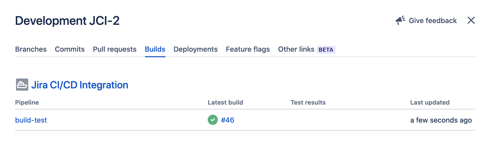
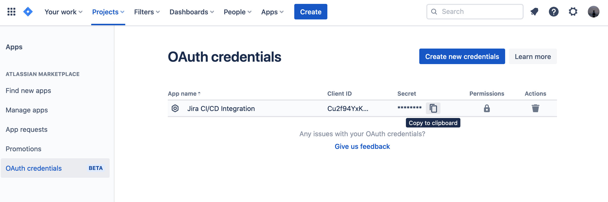
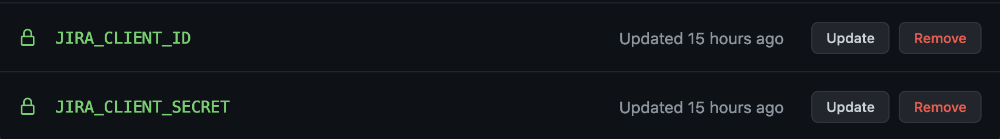

[](https://github.com/rohit-gohri/jira-ci-cd-integration/releases)
[](https://hub.docker.com/repository/docker/boringdownload/jira-integration)
<a href="https://github.com/rohit-gohri/jira-ci-cd-integration/actions"></a>
<a href="https://github.com/rohit-gohri/jira-ci-cd-integration/actions"></a>

# Jira Development Integration

Integrate your CI/CD pipeline's Build and Deployment information into the Jira Development Panel.



> Only supports Jira Cloud. Does not support Jira Server (hosted)

## Prerequisites

### Generate Credentials

Generate new OAuth Credentials and copy

**See:** <https://support.atlassian.com/jira-cloud-administration/docs/integrate-with-self-hosted-tools-using-oauth/>



## Usage With Github Actions

### Add OAuth Creds as secrets to Github

**See:** <https://docs.github.com/en/actions/reference/encrypted-secrets>

- Add Client ID as `JIRA_CLIENT_ID`
- Add Client Secret as `JIRA_CLIENT_SECRET`



### Update Github Workflow

#### Use in Builds Pipeline

```yaml
- name: Jira Integration
  if: ${{ always() }}
  uses: rohit-gohri/jira-ci-cd-integration@v0
  with:
    event_type: build
    state: ${{ job.status }}
    jira_instance: companyname # Subdomain for Jira Cloud
    client_id: ${{ secrets.JIRA_CLIENT_ID }}
    client_secret: ${{ secrets.JIRA_CLIENT_SECRET }}
```

#### Use in Deployment Pipeline

```yaml
- name: Jira Integration
  if: ${{ always() }}
  uses: rohit-gohri/jira-ci-cd-integration@v0
  with:
    event_type: deployment
    state: ${{ job.status }}
    issue: JCI-3, JCI-6 # Comma separated list of issues being deployed/released. You are expected to generate this yourself in a previous step
    jira_instance: companyname # Subdomain for Jira Cloud
    client_id: ${{ secrets.JIRA_CLIENT_ID }}
    client_secret: ${{ secrets.JIRA_CLIENT_SECRET }}
```

## Use with Other CI/CD Providers

Supported in providers which support running arbitrary Docker images (like Drone, Gitlab CI).

Docker Images are available from:

- Docker Hub: `boringdownload/jira-integration`
- Github Container Registry: `ghcr.io/rohit-gohri/jira-ci-cd-integration`
- Gitlab Container Registry: `registry.gitlab.com/rohit-gohri/jira-ci-cd-integration`

Pick whatever you want and is convenient for you.

### Set Env Vars

Configuration for the Docker image is through env vars. Read more in [options](#options).

#### Drone.io

Add secrets for `JIRA_CLIENT_ID` and `JIRA_CLIENT_SECRET` and then add this to your pipeline:

```yaml
steps:
  - name: jira-integration
    image: boringdownload/jira-integration:v0
    environment:
      BUILD_NAME: drone-pipeline
      JIRA_INSTANCE: companyname
      JIRA_CLIENT_ID:
        from_secret: jira_client_id
      JIRA_CLIENT_SECRET:
        from_secret: jira_client_secret
```

#### Gitlab CI/CD

[Add a CI/CD Variable to your project](https://docs.gitlab.com/ee/ci/variables/#add-a-cicd-variable-to-a-project) for `JIRA_CLIENT_ID` and `JIRA_CLIENT_SECRET` and then add this step to your pipeline, preferably in the last stage.

```yaml
jira-integration:
  image: registry.gitlab.com/rohit-gohri/jira-ci-cd-integration:v0
  variables:
    BUILD_NAME: gitlab-pipeline
    JIRA_INSTANCE: companyname
```

## Options

Provide these options directly in case of Github Actions or via the env variable in the brackets for Docker.

### Inputs

#### jira_instance (JIRA_INSTANCE)

Sub Domain of Jira Cloud Instance. This part of the url: `https://<jira_instance>.atlassian.net`

#### client_id (JIRA_CLIENT_ID)

ClientID of OAuth Creds

#### client_secret (JIRA_CLIENT_SECRET)

Client Secret of OAuth Creds

#### event_type (JIRA_EVENT_TYPE) (optional)

"build" or "deployment", (default is "build")

#### state (BUILD_STATE) (optional)

"successful"/"success", "failed", or "canceled" (default is "unknown")

#### issue (JIRA_ISSUES) (optional)

Will be parsed from branch name automatically if absent. Or you can provide it according to your own logic. Can be multiple issues.

#### token (optional)

> Only for Github Action

Github Token to get commit message in Pull Request Events. Since github context doesn't have commit message, we use the Github API to get it from sha.

### Pipeline Info

#### Commit Message (COMMIT_MESSAGE)

If you have the jira id in the commit message then provide this.

#### Pipeline Name (BUILD_NAME)

A name for your pipeline
